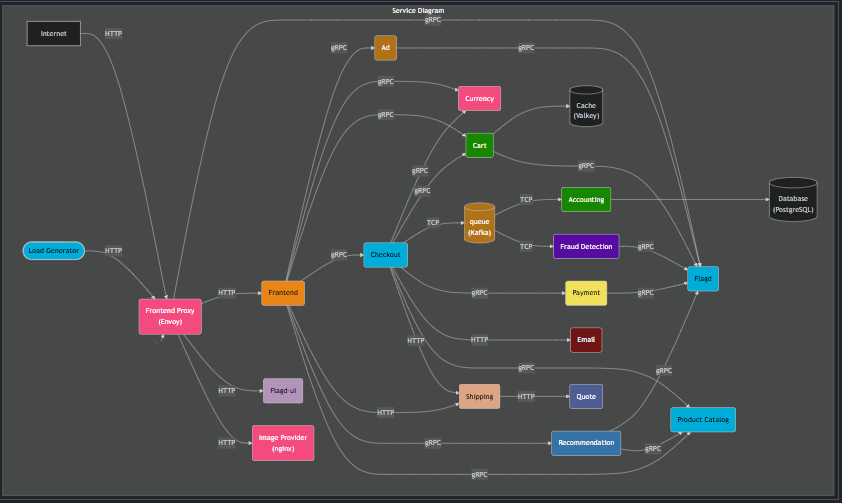

# DevOps Implementation on the OpenTelemetry Astronomy Shop

## Overview

This repository contains an end-to-end DevOps implementation of the OpenTelemetry Astronomy Shop, a microservice-based distributed system designed to demonstrate OpenTelemetry in a near-real-world environment.

The application consists of 13+ microservices written across multiple programming languages and runtimes:

- .NET
- C++
- Elixir
- Go
- Java
- JavaScript
- Kotlin
- PHP
- Python
- Ruby
- Rust
- TypeScript

**Core services:**

- Accounting Service
- Ad Service
- Cart Service
- Checkout Service
- Email Service
- Frontend
- Load Generator
- Payment Service
- Product Catalog Service
- Quote Service
- Recommendation Service
- Shipping Service
- Image Provider Service

## DevOps Overview

The platform uses Amazon Elastic Kubernetes Service (EKS) to run the application. Terraform creates and manages the AWS infrastructure. Docker builds the application images. Amazon Elastic Container Registry (ECR) stores the images.

GitHub Actions runs the continuous integration (CI) pipeline. Argo CD manages continuous delivery (CD) through a GitOps workflow.

OpenTelemetry provides application telemetry. AWS X-Ray provides distributed tracing. Amazon CloudWatch stores application and infrastructure logs. Prometheus collects metrics. Grafana provides dashboards.

The project focuses on the operational work required to run a microservices platform. This includes infrastructure automation, container builds, Kubernetes operations, deployment automation, observability, security, scaling, failure handling, and cost control.
